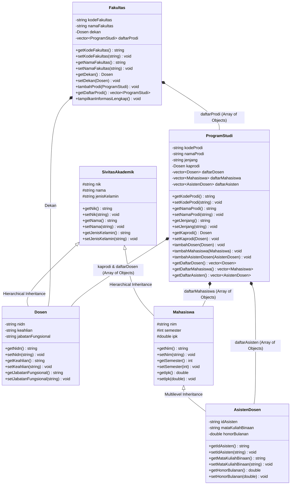
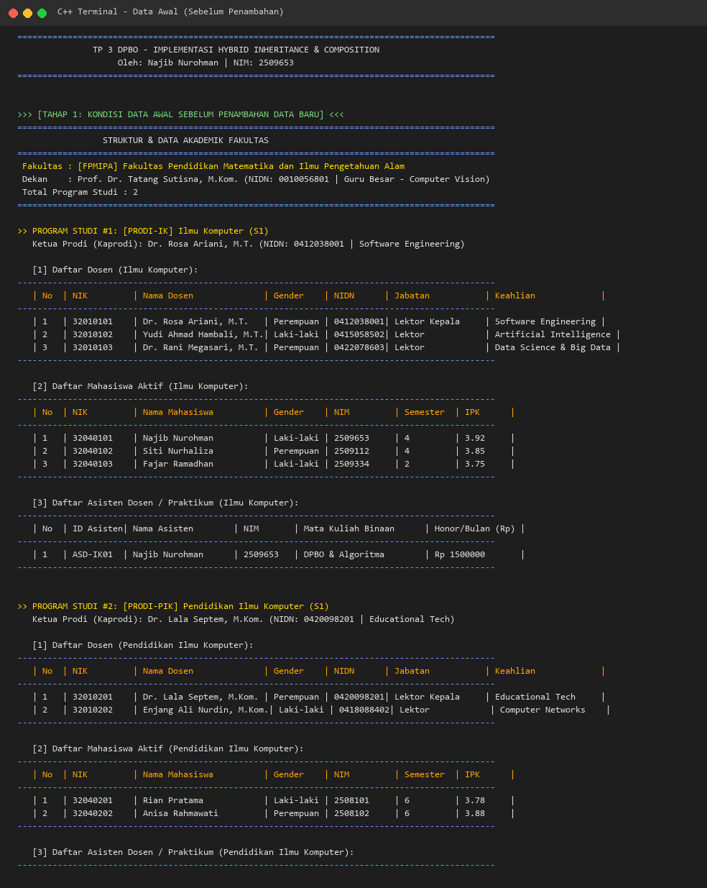
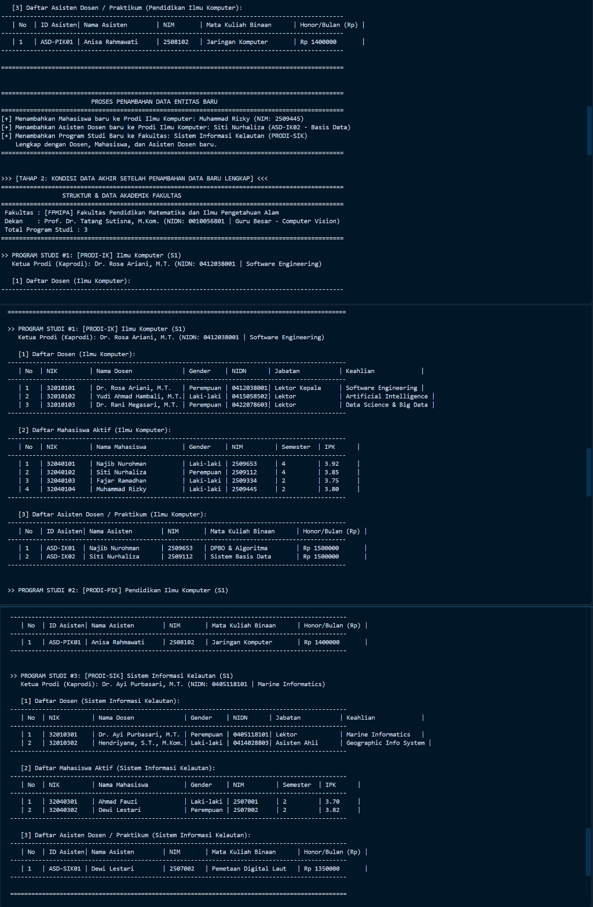
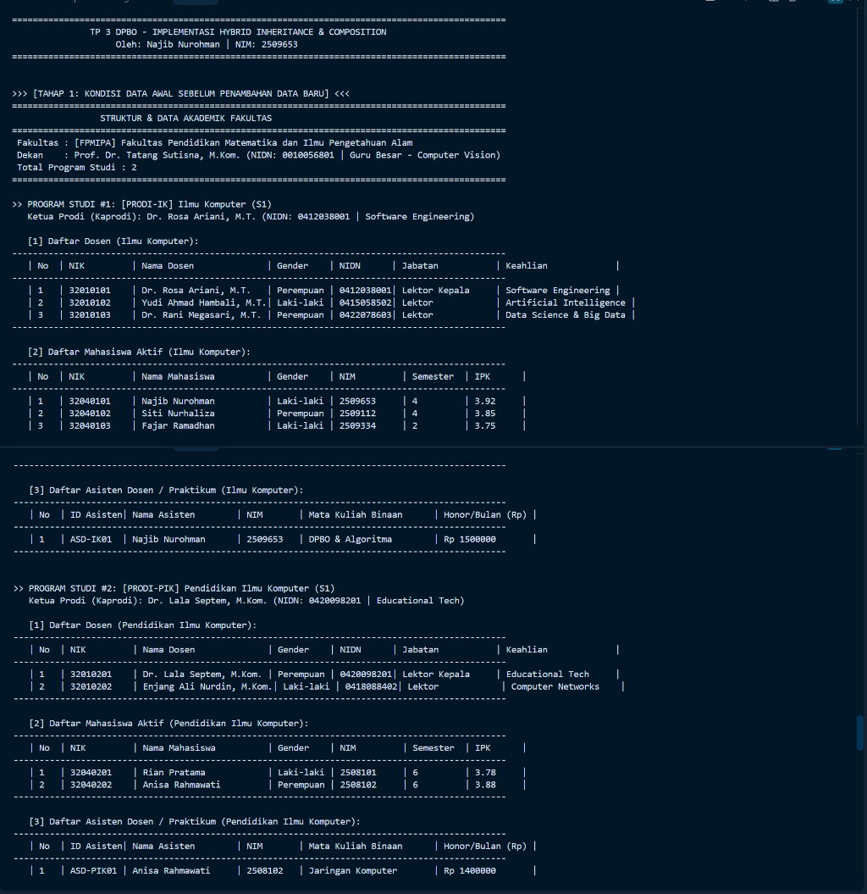
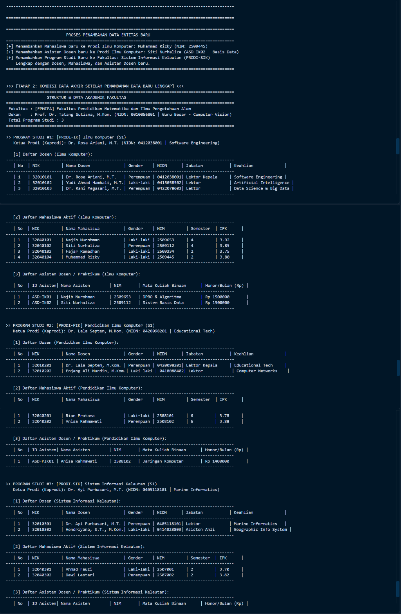
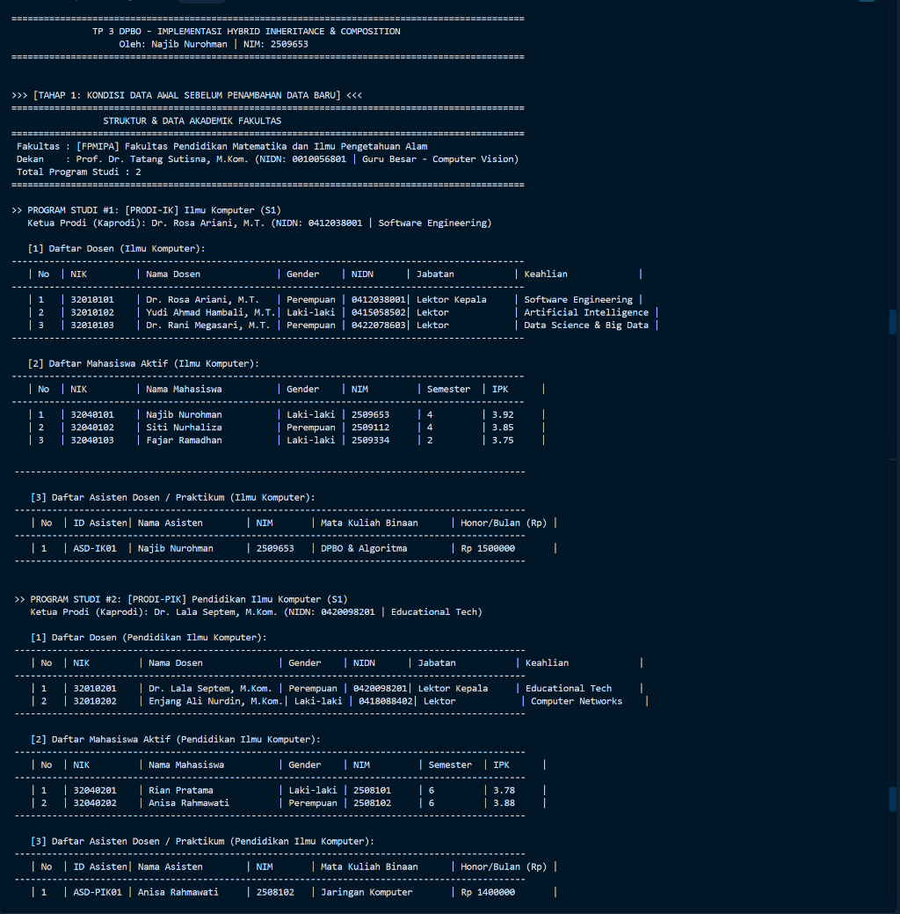
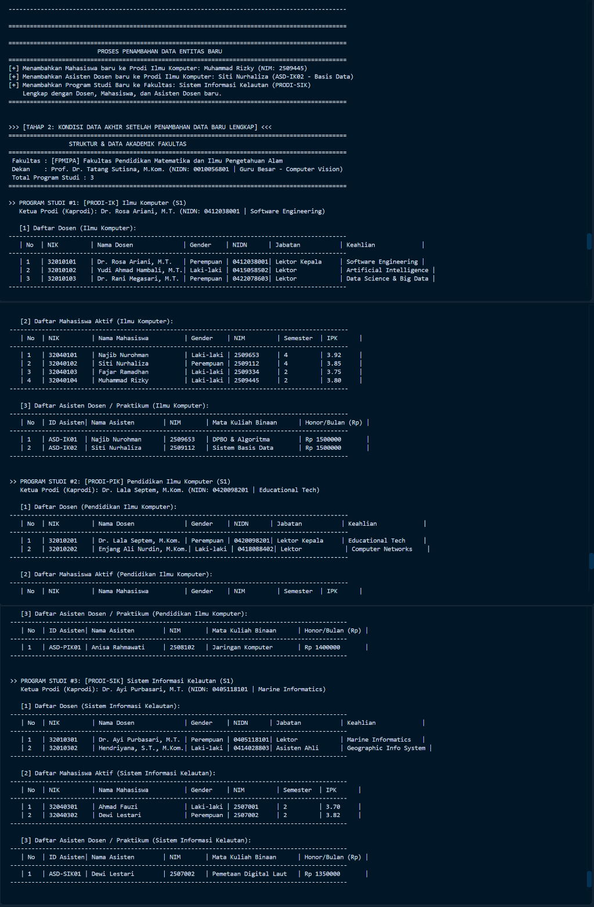
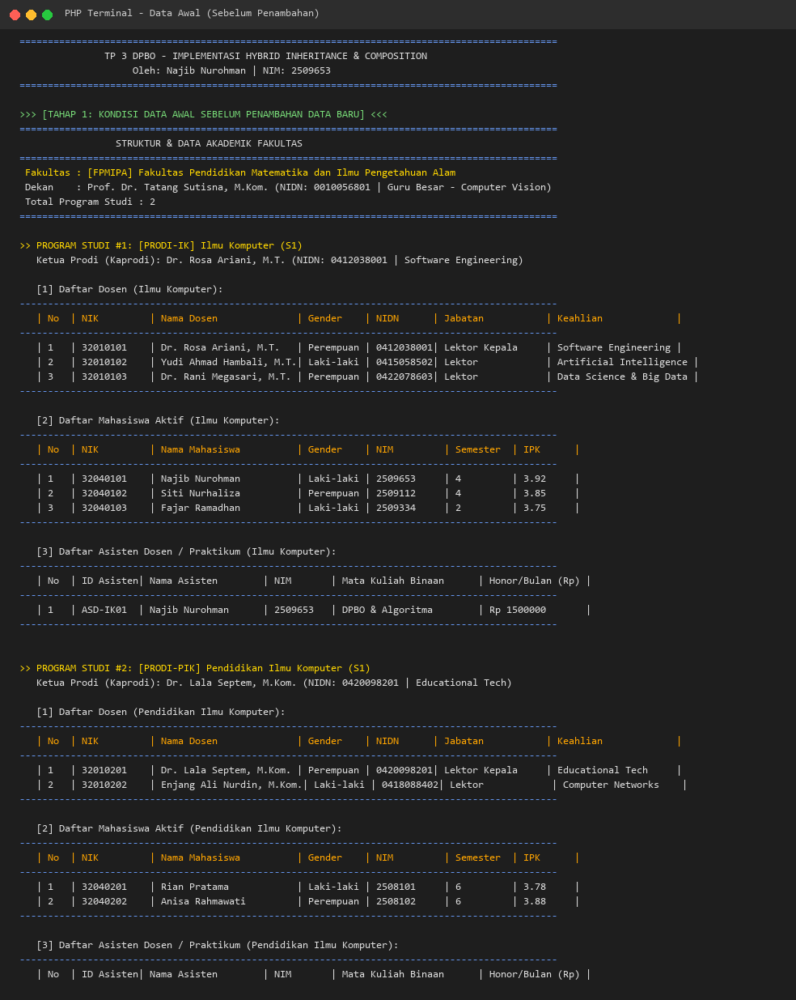
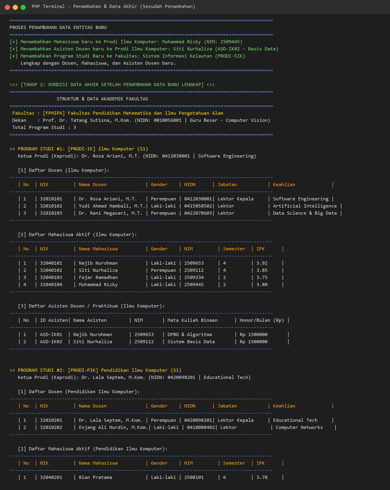

# TP3DPBO2026C1 - TUGAS PRAKTIKUM 3 DPBO (INHERITANCE LANJUTAN & COMPOSITION)

## 📌 JANJI
> Saya **Najib Nurohman** dengan NIM **2509653** mengerjakan **Tugas Praktikum 3** dalam mata kuliah **Desain Pemrograman Berorientasi Objek (DPBO)** untuk keberkahan-Nya maka saya tidak akan melakukan kecurangan seperti yang telah dispesifikasikan. Aamiin.

---

## 📖 DESKRIPSI PROGRAM
Program ini mengimplementasikan konsep **Hybrid Inheritance (Kombinasi Hierarchical & Multilevel Inheritance)** serta **Composition (Komposisi)** dan **Array of Objects** dalam studi kasus **Sistem Manajemen Struktur Akademik Fakultas & Program Studi (Smart Campus Academic Management System)** pada Object-Oriented Programming (OOP).

Repositori ini menyediakan implementasi lengkap ke dalam **4 bahasa pemrograman**:
- 🔷 **C++** (C++17 Standar, CLI)
- 🐍 **Python** (Python 3, CLI)
- ☕ **Java** (Java 21, CLI)
- 🐘 **PHP** (PHP 8, CLI & Responsive Web Interface)

### Fitur Utama Program:
- Inisialisasi data hierarki Fakultas dan Program Studi lengkap dengan Dekan, Kaprodi, Dosen, Mahasiswa, dan Asisten Dosen.
- Menampilkan kondisi data lengkap **SEBELUM** dilakukan penambahan data baru.
- Melakukan operasi **Penambahan Data (Add Data)** baik pada Program Studi yang sudah ada (tambah Mahasiswa & Asisten Dosen) maupun penambahan **Program Studi Baru** ke dalam Fakultas.
- Menampilkan kondisi data lengkap **SESUDAH** dilakukan penambahan data baru.
- Format tabel CLI yang rapi, informatif, dan dinamis, serta antarmuka web modern pada PHP.

---

## 🏗️ DESAIN DIAGRAM PROGRAM (CLASS DIAGRAM)



---

## 🧩 PENJELASAN ATRIBUT DAN METHOD SETIAP KELAS

### 1. `SivitasAkademik` (Base Class)
Merupakan kelas induk teratas yang merepresentasikan entitas dasar seseorang di lingkungan perguruan tinggi.
- **Atribut**:
  - `nik` (`string`): Nomor Induk Kependudukan sebagai tanda pengenal personal.
  - `nama` (`string`): Nama lengkap personal sivitas akademika.
  - `jenisKelamin` (`string`): Jenis kelamin ("Laki-laki" atau "Perempuan").
- **Method**:
  - Konstruktor default & berparameter.
  - Getter dan Setter untuk masing-masing atribut (`getNik()`, `setNik()`, `getNama()`, `setNama()`, `getJenisKelamin()`, `setJenisKelamin()`).

---

### 2. `Dosen` (Subclass dari `SivitasAkademik`)
Kelas turunan yang merepresentasikan tenaga pendidik/dosen.
- **Atribut Tambahan**:
  - `nidn` (`string`): Nomor Induk Dosen Nasional.
  - `keahlian` (`string`): Bidang kepakaran atau fokus keilmuan dosen (misal: *Software Engineering*, *Artificial Intelligence*).
  - `jabatanFungsional` (`string`): Jenjang jabatan akademik dosen (misal: *Asisten Ahli*, *Lektor*, *Lektor Kepala*, *Guru Besar*).
- **Method**:
  - Konstruktor default & berparameter (memanggil super constructor `SivitasAkademik`).
  - Getter dan Setter untuk seluruh atribut khusus `Dosen`.

---

### 3. `Mahasiswa` (Subclass dari `SivitasAkademik`)
Kelas turunan yang merepresentasikan peserta didik/mahasiswa aktif.
- **Atribut Tambahan**:
  - `nim` (`string`): Nomor Induk Mahasiswa.
  - `semester` (`int`): Tingkat semester perkuliahan yang sedang ditempuh.
  - `ipk` (`double`): Indeks Prestasi Kumulatif mahasiswa.
- **Method**:
  - Konstruktor default & berparameter (memanggil super constructor `SivitasAkademik`).
  - Getter dan Setter untuk seluruh atribut khusus `Mahasiswa`.

---

### 4. `AsistenDosen` (Subclass dari `Mahasiswa`)
Kelas turunan bertingkat dari `Mahasiswa` yang merepresentasikan mahasiswa yang mendapatkan amanah tugas tambahan sebagai asisten praktikum/dosen.
- **Atribut Tambahan**:
  - `idAsisten` (`string`): Kode/Nomor unik identitas asisten.
  - `mataKuliahBinaan` (`string`): Nama mata kuliah praktikum yang diampu/diasisteni.
  - `honorBulanan` (`double`): Besaran kompensasi/honorarium bulanan asisten.
- **Method**:
  - Konstruktor default & berparameter (memanggil super constructor `Mahasiswa`).
  - Getter dan Setter untuk seluruh atribut khusus `AsistenDosen`.

---

### 5. `ProgramStudi` (Composite Class & Array of Objects Container)
Kelas yang merepresentasikan satuan unit program studi/jurusan dalam fakultas.
- **Atribut**:
  - `kodeProdi` (`string`): Kode registrasi prodi (misal: `PRODI-IK`).
  - `namaProdi` (`string`): Nama program studi (misal: `Ilmu Komputer`).
  - `jenjang` (`string`): Jenjang akademik (`S1`, `S2`, `D3`).
  - `kaprodi` (`Dosen`): Objek `Dosen` yang menjabat sebagai Ketua Program Studi.
  - `daftarDosen` (`vector<Dosen>` / `List<Dosen>`): Kumpulan objek dosen homebase di prodi terkait (**Array of Objects**).
  - `daftarMahasiswa` (`vector<Mahasiswa>` / `List<Mahasiswa>`): Kumpulan objek mahasiswa aktif di prodi terkait (**Array of Objects**).
  - `daftarAsisten` (`vector<AsistenDosen>` / `List<AsistenDosen>`): Kumpulan objek asisten dosen di prodi terkait (**Array of Objects**).
- **Method**:
  - Konstruktor default & berparameter.
  - Getter dan Setter untuk data metadata prodi dan kaprodi.
  - `tambahDosen(Dosen d)`: Menambahkan objek dosen ke dalam list prodi.
  - `tambahMahasiswa(Mahasiswa m)`: Menambahkan objek mahasiswa ke dalam list prodi.
  - `tambahAsistenDosen(AsistenDosen a)`: Menambahkan objek asisten ke dalam list prodi.
  - Getter untuk mengakses kumpulan objek (`getDaftarDosen()`, `getDaftarMahasiswa()`, `getDaftarAsisten()`).

---

### 6. `Fakultas` (Top-Level Composite Class)
Kelas tingkat teratas yang menaungi seluruh Program Studi.
- **Atribut**:
  - `kodeFakultas` (`string`): Kode singkatan fakultas (misal: `FPMIPA`).
  - `namaFakultas` (`string`): Nama lengkap fakultas.
  - `dekan` (`Dosen`): Objek `Dosen` yang menjabat sebagai Dekan Fakultas.
  - `daftarProdi` (`vector<ProgramStudi>` / `List<ProgramStudi>`): Kumpulan objek program studi yang bernaung di bawah fakultas (**Composition & Array of Objects**).
- **Method**:
  - Konstruktor default & berparameter.
  - Getter dan Setter untuk kode, nama fakultas, dan dekan.
  - `tambahProdi(ProgramStudi p)`: Menambahkan objek prodi baru ke dalam fakultas.
  - `getDaftarProdi()`: Mengakses daftar program studi di dalam fakultas.
  - `tampilkanInformasiLengkap()`: Mencetak seluruh struktur hirarki fakultas, dekan, kaprodi, tabel dosen, tabel mahasiswa, dan tabel asisten dosen secara lengkap dan terformat rapi.

---

## 💡 PENJELASAN DESAIN PROGRAM

### 1. Implementasi Hybrid Inheritance
Program ini menggabungkan dua bentuk pewarisan dasar untuk menciptakan **Hybrid Inheritance**:
- **Hierarchical Inheritance**:
  Kelas dasar `SivitasAkademik` diwarisi secara langsung oleh dua kelas anak terpisah, yaitu `Dosen` dan `Mahasiswa`. Baik dosen maupun mahasiswa mewarisi atribut identitas dasar (`nik`, `nama`, `jenisKelamin`) namun memiliki spesialisasi peran yang berbeda.
- **Multilevel Inheritance**:
  Kelas `Mahasiswa` kemudian diturunkan kembali menjadi kelas `AsistenDosen`. Seorang asisten dosen pada hakikatnya adalah seorang mahasiswa (*AsistenDosen is-a Mahasiswa*), dan seorang mahasiswa adalah sivitas akademika (*Mahasiswa is-a SivitasAkademik*).
- **Kombinasi (Hybrid)**:
  Hubungan `SivitasAkademik -> (Dosen, Mahasiswa -> AsistenDosen)` secara tepat merepresentasikan struktur **Hybrid Inheritance** yang rasional di dunia nyata.

```
       [SivitasAkademik]  <--- Base Superclass
         /           \
        / (Hierarchical)
       v               v
   [Dosen]        [Mahasiswa]
                       |
                       | (Multilevel)
                       v
                [AsistenDosen]
```

### 2. Implementasi Composition (Komposisi)
- Objek `Fakultas` memiliki hubungan kepemilikan utuh (*composition*) terhadap kumpulan `ProgramStudi`. Program studi hidup dan dikelola di dalam konteks fakultas.
- Objek `ProgramStudi` memiliki hubungan komposisi terhadap pimpinan kaprodi (`Dosen`), kumpulan tenaga pengajar (`Dosen`), kumpulan mahasiswa binaan (`Mahasiswa`), dan staf pembantu pengajar (`AsistenDosen`).

### 3. Implementasi Array of Objects
Kumpulan entitas diorganisasi menggunakan struktur larik objek dinamis:
- **C++**: `std::vector<Dosen>`, `std::vector<Mahasiswa>`, `std::vector<AsistenDosen>`, `std::vector<ProgramStudi>`.
- **Python**: `List[Dosen]`, `List[Mahasiswa]`, `List[AsistenDosen]`, `List[ProgramStudi]`.
- **Java**: `List<Dosen>`, `List<Mahasiswa>`, `List<AsistenDosen>`, `List<ProgramStudi>` yang diinstansiasi dengan `ArrayList`.
- **PHP**: `array` bertipe objek (`Dosen[]`, `Mahasiswa[]`, `AsistenDosen[]`, `ProgramStudi[]`).

### 4. Implementasi Error Handling & Validasi Data
Program telah dilengkapi dengan sistem penanganan error (*Exception Handling*) dan validasi integritas data yang konsisten di semua bahasa:
- **Validasi Nilai IPK**: Memastikan nilai IPK mahasiswa berada dalam rentang valid `0.00` s.d. `4.00`. Jika di luar rentang, dilemparkan exception (`std::invalid_argument` / `ValueError` / `IllegalArgumentException` / `InvalidArgumentException`).
- **Validasi Semester & Honor**: Memastikan nilai semester minimal `1` dan honor bulanan asisten tidak bernilai negatif (`>= 0`).
- **Validasi String/ID**: Memastikan field penting seperti NIK, NIM, ID Asisten, Kode Prodi, dan Nama Prodi tidak kosong.
- **Validasi Pencegahan Duplikasi Data**:
  - `tambahDosen()`: Mencegah penambahan dosen dengan NIDN yang sama pada prodi terkait.
  - `tambahMahasiswa()`: Mencegah pendaftaran mahasiswa dengan NIM duplikat.
  - `tambahAsistenDosen()`: Mencegah pendaftaran asisten dengan ID Asisten yang sudah ada.
  - `tambahProdi()`: Mencegah pendaftaran program studi dengan Kode Prodi yang sudah ada di dalam fakultas.
- **Blok Try-Catch / Try-Except**: Setiap *entry point* program (`Main.cpp`, `main.py`, `Main.java`, `index.php`) memiliki blok demonstrasi pengujian error handling untuk menangkap kesalahan secara aman tanpa menyebabkan program *crash*.

---

## 🔄 PENJELASAN ALUR PROGRAM (WORKFLOW)

1. **Inisialisasi Data Awal (Setup Initial State)**:
   - Program membuat objek Dekan (`Dosen`) dan menginstansiasi objek `Fakultas` (misal: FPMIPA).
   - Program membuat objek Kaprodi dan menginstansiasi 2 Program Studi awal: **Ilmu Komputer (S1)** dan **Pendidikan Ilmu Komputer (S1)**.
   - Program menambahkan sekumpulan objek Dosen, Mahasiswa, dan Asisten Dosen ke dalam masing-masing prodi menggunakan method `tambahDosen()`, `tambahMahasiswa()`, dan `tambahAsistenDosen()`.
   - Program mendaftarkan kedua prodi tersebut ke dalam Fakultas dengan `tambahProdi()`.
2. **Menampilkan Data Sebelum Penambahan (Print Stage 1)**:
   - Program memanggil method `tampilkanInformasiLengkap()` pada objek Fakultas untuk mencetak laporan struktur lengkap sebelum ada data baru.
3. **Proses Penambahan Data Baru (Add Data Mutation)**:
   - Menambahkan mahasiswa baru (`Muhammad Rizky`) dan asisten dosen baru (`Siti Nurhaliza`) ke dalam Program Studi Ilmu Komputer.
   - Membuat Program Studi ke-3 baru: **Sistem Informasi Kelautan (S1)** lengkap dengan Kaprodi, Dosen, Mahasiswa, dan Asisten Dosen baru, kemudian mendaftarkannya ke dalam Fakultas.
4. **Menampilkan Data Sesudah Penambahan (Print Stage 2)**:
   - Program kembali memanggil `tampilkanInformasiLengkap()` untuk memvalidasi bahwa seluruh data baru telah terintegrasi dengan sempurna ke dalam hirarki fakultas.
5. **Demonstrasi Error Handling & Validasi**:
   - Menjalankan uji coba pembuatan data tidak valid (misal: IPK = 4.50) dan duplikasi NIM.
   - Menangkap exception dengan `try-catch` / `try-except` dan mencetak pesan error yang jelas dan edukatif.

---

## 📸 DOKUMENTASI EKSEKUSI PROGRAM

### 1. C++ (C++17)
- **Kondisi Sebelum Penambahan Data**:
  
- **Kondisi Sesudah Penambahan Data**:
  

---

### 2. Python (Python 3)
- **Kondisi Sebelum Penambahan Data**:
  
- **Kondisi Sesudah Penambahan Data**:
  

---

### 3. Java (Java 21)
- **Kondisi Sebelum Penambahan Data**:
  
- **Kondisi Sesudah Penambahan Data**:
  

---

### 4. PHP (PHP 8)
- **Kondisi Sebelum Penambahan Data**:
  
- **Kondisi Sesudah Penambahan Data**:
  

---

## 📁 STRUKTUR FOLDER PROYEK

```
TP 3/
├── .gitignore
├── CPP/
│   ├── Program/
│   │   ├── SivitasAkademik.hpp
│   │   ├── SivitasAkademik.cpp
│   │   ├── Dosen.hpp
│   │   ├── Dosen.cpp
│   │   ├── Mahasiswa.hpp
│   │   ├── Mahasiswa.cpp
│   │   ├── AsistenDosen.hpp
│   │   ├── AsistenDosen.cpp
│   │   ├── ProgramStudi.hpp
│   │   ├── ProgramStudi.cpp
│   │   ├── Fakultas.hpp
│   │   ├── Fakultas.cpp
│   │   └── Main.cpp
│   └── Dokumentasi/
│       ├── cpp_sebelum.png
│       ├── cpp_sesudah.png
│       └── cpp_demo.png
├── Python/
│   ├── Program/
│   │   ├── SivitasAkademik.py
│   │   ├── Dosen.py
│   │   ├── Mahasiswa.py
│   │   ├── AsistenDosen.py
│   │   ├── ProgramStudi.py
│   │   ├── Fakultas.py
│   │   └── main.py
│   └── Dokumentasi/
│       ├── python_sebelum.png
│       ├── python_sesudah.png
│       └── python_demo.png
├── Java/
│   ├── Program/
│   │   ├── SivitasAkademik.java
│   │   ├── Dosen.java
│   │   ├── Mahasiswa.java
│   │   ├── AsistenDosen.java
│   │   ├── ProgramStudi.java
│   │   ├── Fakultas.java
│   │   └── Main.java
│   └── Dokumentasi/
│       ├── java_sebelum.png
│       ├── java_sesudah.png
│       └── java_demo.png
├── PHP/
│   ├── Program/
│   │   ├── SivitasAkademik.php
│   │   ├── Dosen.php
│   │   ├── Mahasiswa.php
│   │   ├── AsistenDosen.php
│   │   ├── ProgramStudi.php
│   │   ├── Fakultas.php
│   │   └── index.php
│   └── Dokumentasi/
│       ├── php_sebelum.png
│       ├── php_sesudah.png
│       └── php_demo.png
├── generate_docs.py
└── README.md
```
